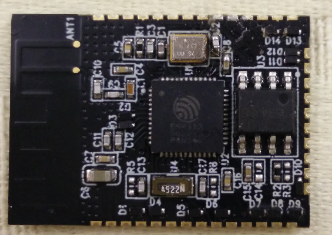
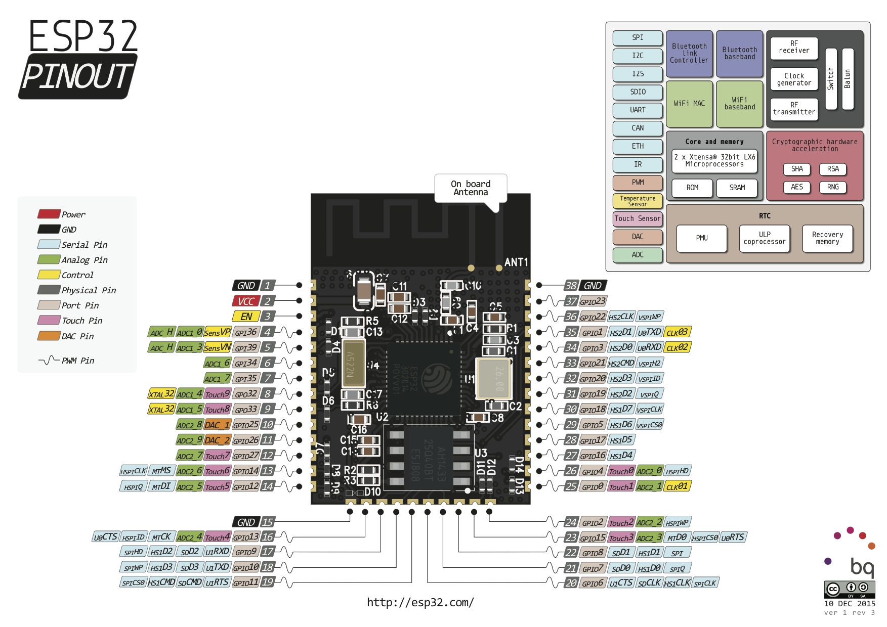

## Table of contents
  * [ESP31B](#esp31b)
	* [Pinout](#pinout)
    * [Boot Messages and Modes](#boot-messages-and-modes)
      * [rst cause](#rst-cause)
      * [boot mode](#boot-mode)
 

## ESP31B



### Pinout




### Hardware Setup for Bootloading and Usage

| Nr        | PIN           | Resistor  | Serial Adapter |
| --------- | ------------- | --------- | -------------- |
| 2         | VCC           |           | VCC (3.3V)     |
| 1, 15, 38 | GND           |           | GND            |
| 35        | TX0           |           | RX             |
| 34        | RX0           |           | TX             |
| 25        | GPIO0         | PullUp    | DTR            |
| 3         | EN (Reset)    | PullUp    | RTS            |
| 24        | GPIO2         | PullDown* |                |
| 29        | GPIO5         | PullUp*   |                |


* Note
	GPIO2 and GPIO5 resistor are optional but they improved stability, 
	keep the levels in mind by attaching external hardware.


### Boot Messages and Modes

The ESP module checks at every boot the GPIOs 0, 1 (TX), 2, 4, 5 and 15 (MTDO)
based on them its boots in different modes:


| PIN            | Uart Bootloader | Boot sketch (SPI flash)  |
| -------------- | --------------- | ------------------------ |
| GPIO0          | 0V              | 3.3V                     |
| GPIO1 (TX)     | 3.3V            | 3.3V                     |
| GPIO2          | 0V              | x                        |
| GPIO4          | x               | x                        |
| GPIO15 (MTDO)  | x               | x                        |
| GPIO5          | x               | 3.3V                     |


the Strart up messages are printed with 115200 Baud and on pin TX0 (pin 35)
example:

```
 ets Jul  5 2015,rst cause:1, boot mode:(11)
```

#### rst cause

| Number | Description             |
| ------ | ----------------------- |
| 1      | power on          	   |
| 2      | external reset          |
| 4      | hardware watchdog reset |


#### boot mode

the number represent a PIN state the displayed number is in hex.

| Bit  | Description             |
| ---- | ----------------------- |
| 7    |                         |
| 6    |                         |
| 5    | GPIO0                   |
| 4    | GPIO1 (TX)              | 
| 3    | GPIO2                   |
| 2    | GPIO4                   |
| 1    | GPIO15 (MTDO)           |
| 0    | GPIO5                   |


This results in the following mapping:

| Mode                    | Numbers                        |
| ----------------------- | ------------------------------ |
| Uart Bootloader         | 10, 11, 12, 13, 14, 15, 16, 17 |
| Boot sketch (SPI flash) | 30, 32, 34, 36, 38, 3A, 3C, 3E |


